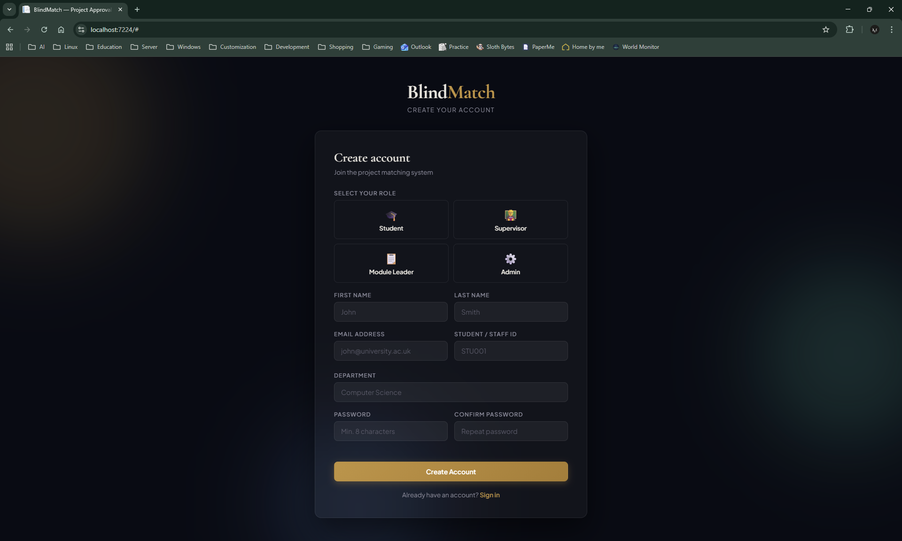
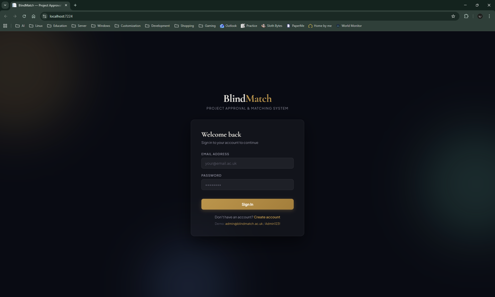
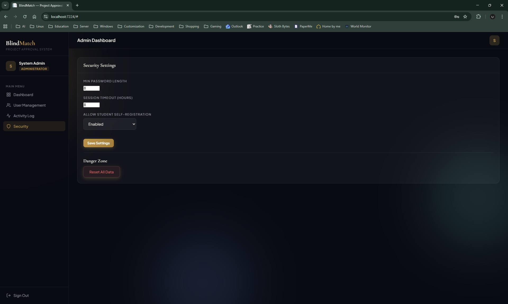
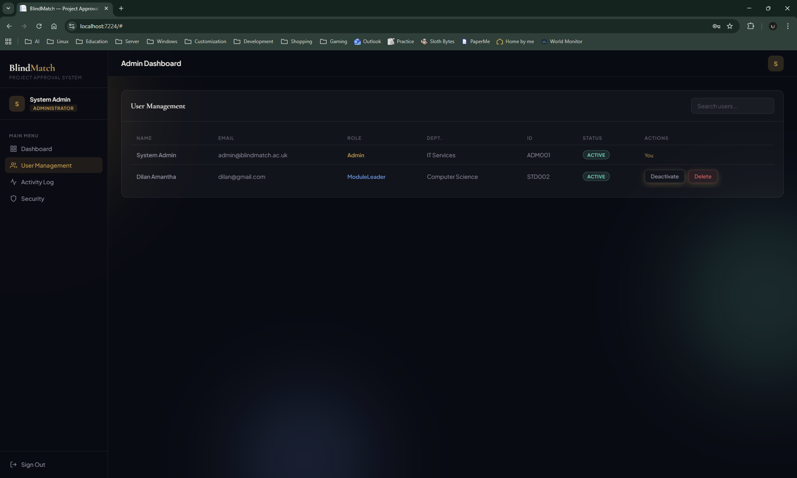

# 🎭 Blind_Match
> A web-based Project Approval System (PAS) that fairly matches student research proposals with academic supervisors — anonymously.

Students submit project proposals. Supervisors browse them **without seeing student identities**, selecting based purely on technical merit and research area alignment. Once a match is confirmed, both identities are revealed and collaboration begins.

---

## ✨ Features

| Role | Key Capabilities |
|---|---|
| **Student** | Submit proposals, track status (Pending → Under Review → Matched), view revealed supervisor details post-match |
| **Supervisor** | Set research area preferences, blind-browse proposals, confirm matches, trigger identity reveal |
| **Module Leader** | Manage research area tags, oversee all matches, manually reassign projects, manage user accounts |
| **System Admin** | Configure environment, manage DB migrations, enforce Role-Based Access Control (RBAC) |

- 🔒 Blind matching — student identity hidden until supervisor confirms interest
- 🏷️ Research area tagging (e.g. AI, Cybersecurity, Web Development)
- 📊 Admin dashboard with full allocation oversight
- 🔐 Role-Based Access Control — Students, Supervisors, Coordinators, and Admins are strictly separated

---

## 🛠 Tech Stack

- **Backend** — ASP.NET Core
- **Database** — SQL Server + Entity Framework Core (Migrations)
- **Frontend** — Razor Pages / MVC Views
- **Auth** — ASP.NET Identity with RBAC

---

## ⚙️ Setup

### Prerequisites
- [.NET 8 SDK](https://dotnet.microsoft.com/)
- SQL Server (local or remote)
- Visual Studio 2022 / VS Code

### Steps

```bash
# 1. Clone the repo
git clone https://github.com/kdsmaduranga/Blind_Match.git
cd blind_match

# 2. Configure your connection string
# Edit appsettings.json → ConnectionStrings → DefaultConnection

# 3. Apply database migrations
dotnet ef database update

# 4. Run the application
dotnet run
```

Navigate to `https://localhost:5053` in your browser.

---

## 📸 Preview

> _Screenshots coming soon_

<!-- 
  Add screenshots here once available:
  
  
  
  
-->
